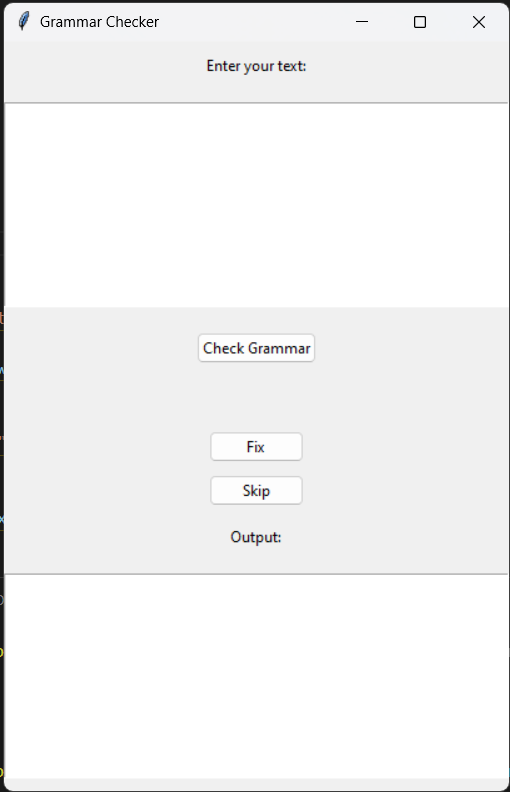

# Grammar Checker App

A simple and effective tool to check grammar in your text, built with `tkinter` and `language_tool_python`.

## Details

**Modules Needed**:

- `tkinter` (comes pre-installed with Python)
- `language_tool_python` 

To install the necessary modules, run: pip install language_tool_python

## Features:

- Grammar Check: Quickly check for grammar mistakes in your text.
- Interactive UI: User-friendly interface to check and correct your mistakes.
- Error Suggestions: Provides suggestions to correct your mistakes.
- Multiple Actions: Choose to fix or skip a grammar suggestion.

## Getting Started:

- Clone the repository: git clone https://github.com/Bisalkumar/Grammar-Checker.git
- Navigate to the repository and install the required modules.
- Run the Grammar_God.py to launch the application.

## How to Use
- Enter your text in the input box.
- Click on "Check Grammar".
- Browse through the suggestions provided. Choose to either "Fix" or "Skip".
- Once all errors are addressed, the corrected text will appear in the output section.

## Screenshots

## Contributions
Pull requests are welcome. For major changes, please open an issue first to discuss what you would like to change.

## License

MIT

## Acknowledgement
- language_tool_python for providing the grammar check capabilities.